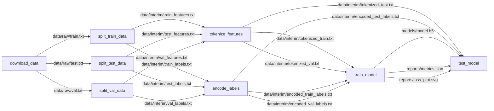

---

There are a total of 8 stages.

You can all run stages sequentially by running the following command:
```bash
dvc repro
```

You can also run a specific stage by running the following command:
```bash
dvc repro <stage_name>
```